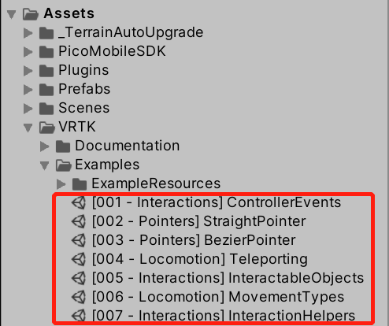

# VRTK Support

## Unity Versions

Unity2019.3.6

## Description

There are seven scenes which are already configured in Assets-VRTK-Examples".

## Note

Please keep in mind that the guide has to be executed in this order. If not, then the integration might not be as desired. 
VRTK should already be installed and you need access to the files given in this folder. It's tested in Unity 2019.2.2f1 and confirmed to work in that version. 
Not all features might be implemented. These features can be found in the provided VRTK demo scenes. 
Also, be sure to make a backup (or two) beforehand.

## Installation

1. Import Pico SDK and apply recommended settings. This will also set the build target to Android and if not set already, it can take a long time depending on the project size. 
2. Copy the "Pico" folder (located in the SDK folder) into your projects VRTK->Source->SDK folder.
3. Copy the "PicoVR.prefab" file into your projects prefab folder.
4. Close Unity.
5. Replace the "VRTK_SDKManager.cs" file in the VRTK -> Source -> Scripts -> Utilities -> SDK folder with the existing file (in order to let VRTK detect the Pico headset) while Unity is closed!
6. Reopen the Unity project.
7. Drag PicoVR prefab into your scenes [VRTK_SDKManager] -> [VRTK_SDKSetups].
8. Select [VRTK_SDKManager] and add the PicoVR game object that you just placed into the setups list.
9. Click on the “Remove All Symbols" button in the [VRTK_SDKManager]. 
10. Uncheck “Auto Manager”, click on the “Manage Now" button and check the “Auto Manage" once again.
11. Go to Edit > Project settings > Player > XR Settings and add “None” as an option for VR devices.
12. Hook up all required components for the specific application you are working on (if there are any.)
13. You're done!
